# Robotics Quadrathlon
*A camera and a LIDAR based robotics quadrathlon with a Clearpath Jackal robot. Implemented with ROS in Ubuntu.*
**Contributors: [Narendra Patwardhan](https://github.com/NarendraPatwardhan/) & [Aliaksei Petsiuk](https://github.com/apetsiuk)**
<br/> <br/>
[Video 1](https://www.youtube.com/watch?v=2_tBJL9kv4g) <br/>
[Video 2](https://www.youtube.com/watch?v=hT2FvKOHYw8&t=21s) 
<br/> <br/> 

### Project Objectives

For the final project you must develop a complex, integrated ROS package based on the Jackal. When complete your Jackal should be capable of four behaviors. 

1. Stop Line Challenge: Move in a straight line and stopping in front of a lines made of blue painters tape.
2. Lane following: Follow a path defined by two lines. Also defined by blue painters tape. 
3. Closed patrolling by wall following.
4. Person following.


### General competition guidelines

- Your Jackal should execute behaviors when a button on the controller is pressed as outline above. The behavior should continue until an exit condition is reached or the Jackal is manually interrupted.
- If either R1 or L1 is pressed the Jackal should exit the behavior and return to manual driving mode.
- At no time should the Jackal collide with an object, wall, person, or other obstacle.

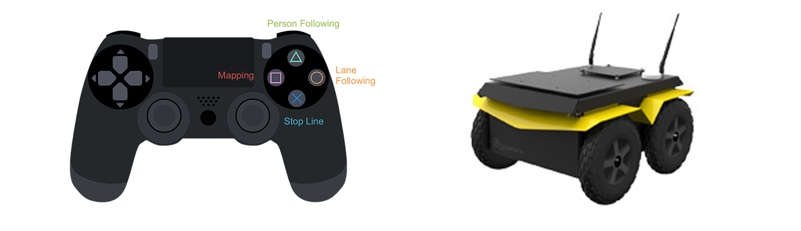

### Behavior Specific Details

##### 20 pts - Stop Line Challenge.

- Your Jackal will be staged facing the end of the course.
- Upon pressing the "X" button your Jackal should begin driving forward in a straight line. The - Jackal should stop when it encounters a long blue line across its path.
- There will be at least one and as many as five stop lines.
- The Jackal should stop as close to each line without going over.
- The Jackal should stop completely for 2 seconds at each line.
- The Jackal should exit the behavior if the path forward is fully obstructed after coming to a stop at a safe distance from the obstruction.

**Scoring criteria:** the winner of the event will be the team that completes the course in the shortest time without going over any of the stop lines.

##### 20 pts - Lane Following

- The Jackal will be driven the start of the course. Upon pressing the "Circle" button on the controller the Jackal should proceed forward through the course. Stopping when the lane is fully obstructed.
- The Jackal should stay within the lane markings at all time.

**Scoring criteria:** the winner of the event will be the team the completes the course in the shortest time without leaving the course.

##### 20 pts - Room patrolling

- Upon pressing "square" button the Jackal should navigate to the nearest wall/barrier and explore the space by wall-following.
- Your Jackal should avoid obstacles placed along its path and return to the wall.
- At no time should your Jackal make contact with the wall or any obstacle.
- In your presentation demonstrate how this behavior can be used for room mapping.

##### 20 pts - Person following

- Upon pressing the "triangle" button the Jackal should begin following the person closest to the Jackal.
- The Jackal should maintain a safe distance from the person as they move.
- While following the Jackal should avoid obstacles.
- You may use a brightly colored ball, ALVAR tag, or other aid to identify the person.

**Scoring:** the winner of this event will be the team with the most natural person following. i.e. smooth motion, consistent distance between Jackal and person, etc.

##### 20 pts - Presentation

- Deliver a presentation during the lab section on the due date. Describe your design and the motivation/reasoning/approach for your design choices.
- Include videos of your Jackal in action demonstrating

**Scoring:** the winner of this event will be the team with the best overall presentation.


# INSTALL AND RUN

```
mkdir -p raccoon_ws/src
cd raccoon_ws
catkin_make
cd src
git clone *this repository*

cd raccoon_ws
catkin_make
source devel/setup.bash
```
Install necessary textures for simulation
```
cd quad_pkg/src/shell
source prereq.sh
```
Launch simulation environment
```
cd raccoon_ws
roslaunch quad_pkg sim_world.launch
```
Launch real environment
```
cd raccoon_ws
roslaunch quad_pkg real_world.launch
```

Use joystick to control Jackal:

```
CIRCLE   - Lane Following
SQUARE   - Room Patrolling
X        - Stop Line
TRIANGLE - Person Following

R1 - Cancel Script execution
```


## Launch files description

| Function name | Description                    |
| ------------- | ------------------------------ |
| `real_world.launch`      | Control real Jackal equipped with Hokuyo lidar and 2 PS3 cameras      |
| `sim_world.launch`   | Spawn Jackal into simulation environment  |


# COPLETION STEPS

---> Video is available <---

#### Working process

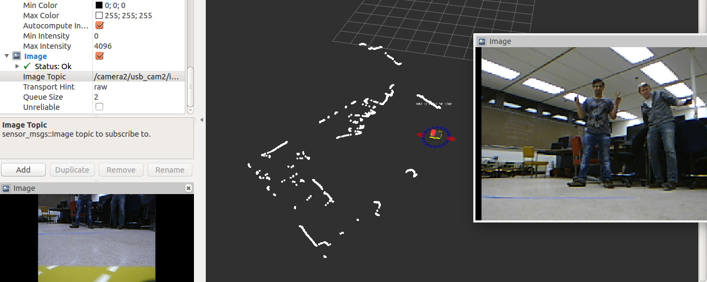

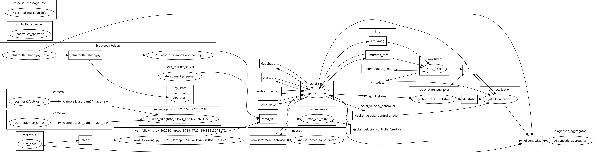

#### Simulation stage

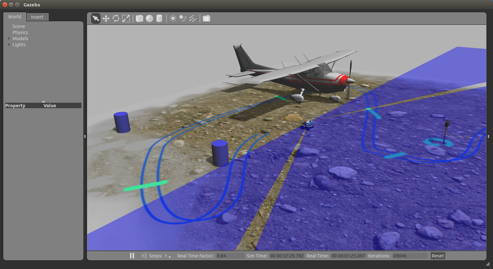

#### Texture types

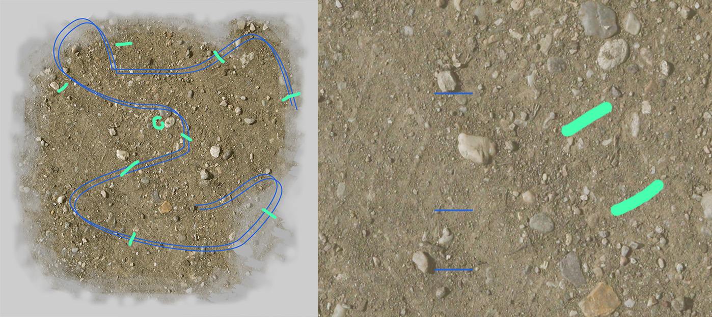

#### Stop line behaviour

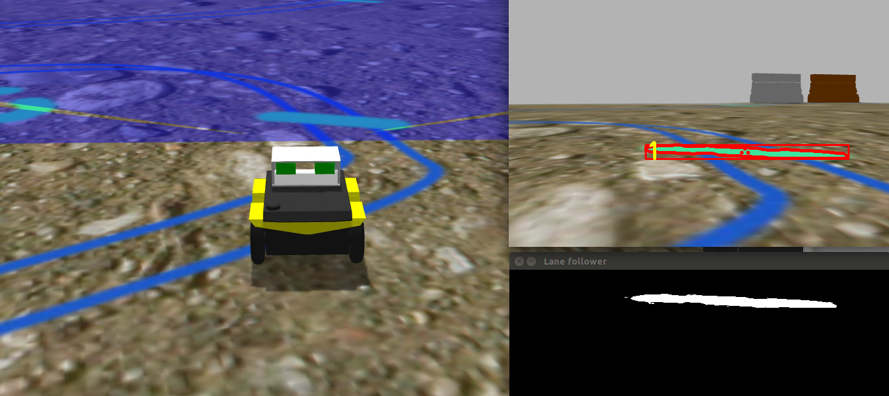

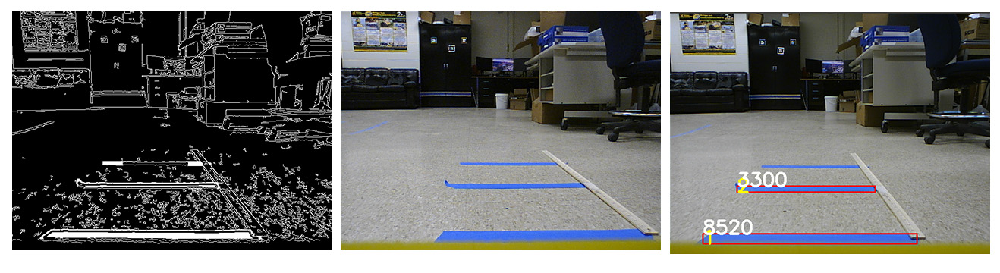

#### Person following

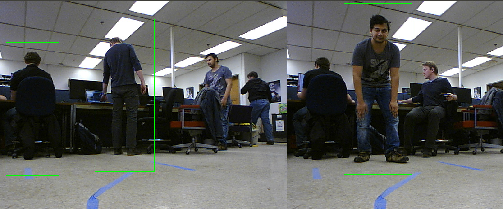

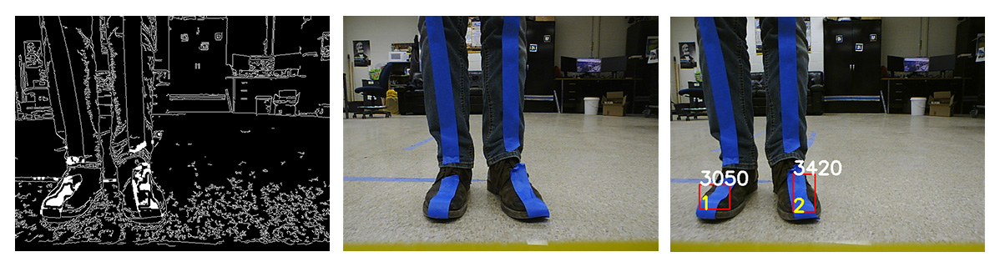

#### Lane following

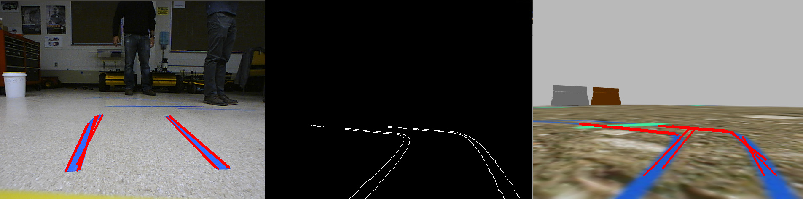


#### Implemented velocity ramps

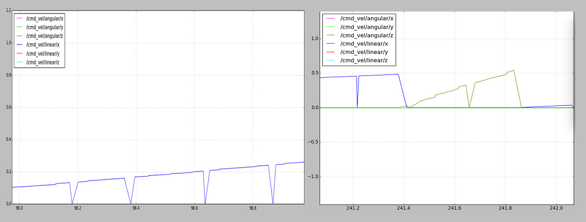


